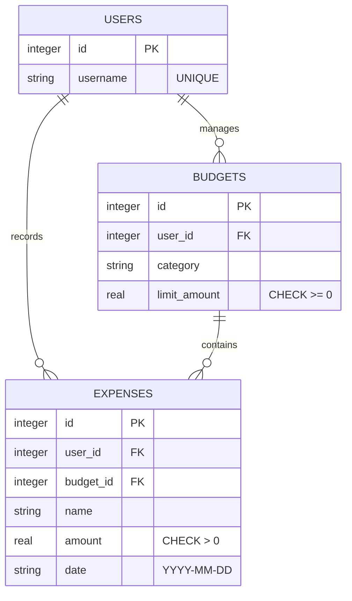

# Overview

## Sprint 1
EasyBudget is a simple command-line expense tracker built in Kotlin. The goal of this project is to strengthen my skills as a software engineer by exploring the fundamentals of the Kotlin language while building a practical tool. Through this project, I aimed to understand how Kotlin handles variables, conditionals, loops, functions, classes, properties, and data classes, and how these concepts can be applied to real-world software.

The software allows users to record expenses, categorize them, and compare total spending against a budget limit. It demonstrates how Kotlin’s syntax and features can be used to implement clean, concise, and expressive code. My purpose in writing this software was to deepen my knowledge of Kotlin’s object-oriented programming capabilities and practice building a small but functional CLI application.

## Sprint 2
As a software engineer, I am developing **Easy Budget** to bridge the gap between high-level logic and persistent data management. My goal with this project is to master Kotlin’s object-oriented principles while gaining hands-on experience with relational database integration, specifically using the "Serverless" local-first architecture.

Easy Budget is a financial management tool currently operating as a Command Line Interface (CLI). It allows users to create, read, update, and delete (CRUD) financial records. Unlike simple in-memory trackers, this software interfaces directly with a SQLite database, ensuring that budget data persists across different sessions. The logic includes data validation, object-relational mapping using Kotlin Data Classes, and aggregate financial calculations.

The purpose of writing this software is to establish a robust backend foundation for a future native Android application. By handling the database logic in a standalone Kotlin environment first, I can ensure the core financial engine is stable, type-safe, and efficient before introducing the complexities of a mobile User Interface.

## Diagrama relacional (Mermaid ER)


## Software Demo Videos

[Video Sprint 1](https://youtu.be/QyvKhQnDOjU) <br>
[Video Sprint 2](http://youtube.link.goes.here) 

# Development Environment

- **IDE/Editor:** Visual Studio Code & Kotlin Playground (for quick testing)
- **Programming Language:** Kotlin
- **SQLite:** Used for local, serverless data persistence on the device.
The software is built using **Kotlin 1.9** and leverages:
* **JDBC (Java Database Connectivity):** To build and submit dynamic SQL commands.
* **The Repository Pattern:** An architectural design that decouples the application logic from the specific database implementation.

### How to run Sprint 1, branch 1st-sprint-v3
```
kotlinc EasyBudget.kt -include-runtime -d EasyBudget.jar
java -jar CLI-EasyBudget.jar
```

### How to run Sprint 2, branch 2nd-sprint-v2
```powershell
# use PowerShell
EasyBudget> kotlinc src/main.kt src/models/Expense.kt src/database/DatabaseManager.kt src/models/Budget.kt src/models/User.kt -cp "lib/sqlite-jdbc-3.51.2.0.jar" -include-runtime -d EasyBudget.jar

# use PowerShell or VS Code terminal
java --enable-native-access=ALL-UNNAMED -cp "EasyBudget.jar;lib/*" MainKt
```

# Useful Websites

- [Kotlin Official Documentation](https://kotlinlang.org/docs/home.html)  
- [Kotlin Playground](https://play.kotlinlang.org/)  
- [JetBrains Blog on Kotlin](https://blog.jetbrains.com/kotlin/)  
- [Stack Overflow](https://stackoverflow.com/questions/tagged/kotlin)  
- [GeeksforGeeks Kotlin Tutorials](https://www.geeksforgeeks.org/kotlin-programming-language/)  
- [What Is a Relational Database?](https://www.oracle.com/database/what-is-a-relational-database/)  
- [Relational Databases](https://en.wikipedia.org/wiki/Relational_database)  
- [SQL Tutorial](https://www.w3schools.com/sql/)  
